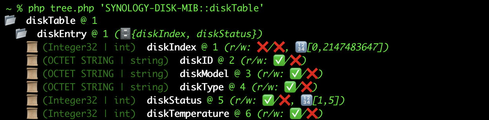

# 🗄️ <sup>(the)</sup> SNMP MIB Parser

If you have ever needed to deal with [SNMP](https://en.wikipedia.org/wiki/Simple_Network_Management_Protocol), and 
especially with [SNMP in PHP](https://www.php.net/manual/en/book.snmp.php) you know how important accurate name to
OID mappings are. This library offers that, and way more exposing **the** SNMP library - `Net-SNMP` - to PHP!

If you hated SNMP I hope this library can convince you to stop ;)

## Basics
### What's SNMP?
SNMP is a networking protocol allowing for information exchange between hosts, think about it like a REST from 1990s. 
While the protocol is certainly dated it's still used everywhere... and thus available on almost all network-enabled
hardware.  

Nowadays the SNMP is used mostly to pull metrics (e.g. list of devices connected to a WiFi access point, or free disk 
space on a server)... but nobody said it cannot be used to control [your coffee pot](https://www.ietf.org/rfc/rfc2325.html)!


### So, what are MIBs?
MIB, or *management information base*, is a collection of textual files containing description of the data present on a
remote system. Without these files most of the information is just a meaningless set of numbers and strings. Even worse,
without MIBs you cannot request `sysUpTime.0` but `1.3.6.1.2.1.1.3.0`... yikes!

MIBs installed on a system calling a remote SNMP host allow for simple querying and validation of the data. They also
describe exactly WHAT can be requested from the remote system.


## What this library brings?
Almost every *nix system comes with [`Net-SNMP`](http://net-snmp.sourceforge.net) library and [tools for it](https://wiki.debian.org/SNMP).
For example to see the structure describing installed disks on a Synology NAS you can use a single command to print a
nice tree:

```
% snmptranslate -Tp 'SYNOLOGY-DISK-MIB::diskTable'
+--diskTable(1)
   |
   +--diskEntry(1)
      |  Index: diskIndex, diskStatus
      |
      +-- ---- Integer32 diskIndex(1)
      |        Range: 0..2147483647
      +-- -R-- String    diskID(2)
      +-- -R-- String    diskModel(3)
      +-- -R-- String    diskType(4)
      +-- -R-- Integer32 diskStatus(5)
      |        Range: 1..5
      +-- -R-- Integer32 diskTemperature(6)
```

However, there's no programmatic access to all the information presented in that tree (and parsing it is a fragile 
nightmare). 

`Net-SNMP` provides everything needed, and it's **the** library for SNMP interactions & MIB parsing. Unfortunately, it's 
written in `C` is , it has no PHP binding. Since MIB standard is in active development for close to 35 years, pretty 
much there are no fully compatible options other than `Net-SNMP`.

### ...but can't we use `Net-SNMP` in PHP?!
Yes! Since PHP 7.4 it's possible thanks to [FFI](https://www.php.net/manual/en/book.ffi.php). It's not easy, due to a 
ton of ancient-C magic present in many places, yet possible.    
This library hides the complexity behind a nice object-oriented interface.


<sup>*(example above is included in [`examples`](examples/) directory)*</sup>


## Requirements
 - PHP 7.4 (64-bit, since SNMP contains such types)
 - Release version of `libnetsnmp`
   - **macOS** ships with it (`/usr/lib/libnetsnmp.25.dylib`), as well as all tools like `snmptranslate` 
   - **Linux** will require installation of a package (e.g. Debian/Ubuntu: `snmp`)
   - **Windows** requires installation, Net-SNMP repository [contains precompiled binaries](https://sourceforge.net/projects/net-snmp/files/net-snmp%20binaries/)


## License
The library itself is [MIT-licensed](LICENSE). However, the code uses & includes parts of Net-SNMP. The code source tree contains
parts of Net-SNMP header files, as well as structures (e.g. constants) translated from C to PHP.  
For details about NET-SNMP licensing see [LICENSE-NETSNMP](LICENSE-NETSNMP).

*I'm not a lawyer, but this stuff is free & open-source and you can use it - just play fair and include the licenses ;)*
